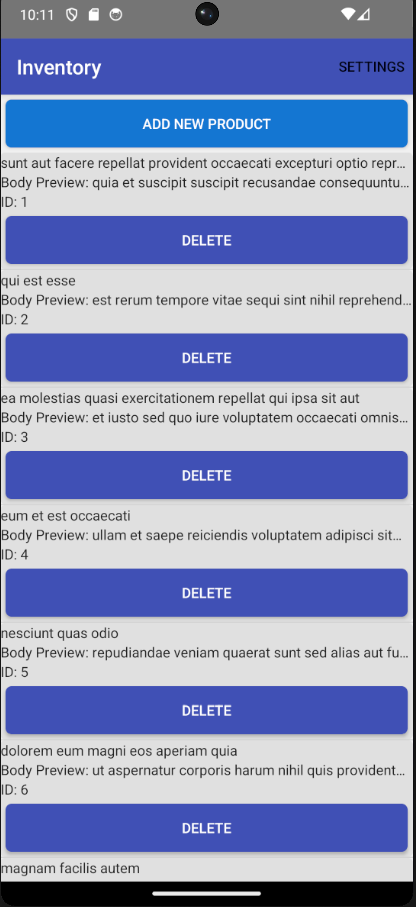
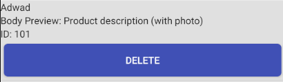
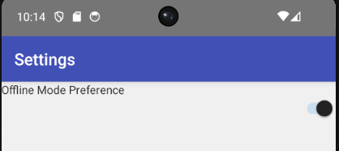

# NativeScript: Scan Inventory

## Cel
Zbuduj podstawową aplikację w **NativeScript używając framework Angular**, która używa **natywnej funkcji** oraz **komunikuje się z API**, z **3–4 widokami**.

## Zakres i wymagania funkcjonalne
- **Natywna funkcja (min. 1):** wybierz i uzasadnij (np. aparat/kamera – skan/zdjęcie, pliki, geolokalizacja, latarka, wibracje).
- **API (min. 1 endpoint):** pobranie listy elementów lub zapis nowego.
- **Widoki (3–4):**
  1. **Lista produktów** (nazwa, kod, mini-status).

  

  2. **Szczegóły produktu** (opis, zdjęcie/skan, akcje: usuń/edytuj).

  

  3. **Dodaj produkt** (formularz + akcja natywna, np. „zeskanuj/zdjęcie”).

  

  4. *(Opcjonalnie)* **Ustawienia** (np. preferencje, tryb offline).

  

**** Installation and Setup

Navigate to the Project Folder: Open your terminal and change the directory to the project folder
- cd ScanInventory
Install Dependencies: Install all required Node.js packages and NativeScript dependencies:
- npm install
Run the Application: Execute the following command to build, install, and launch the application on your Android emulator or device:
- ns run android